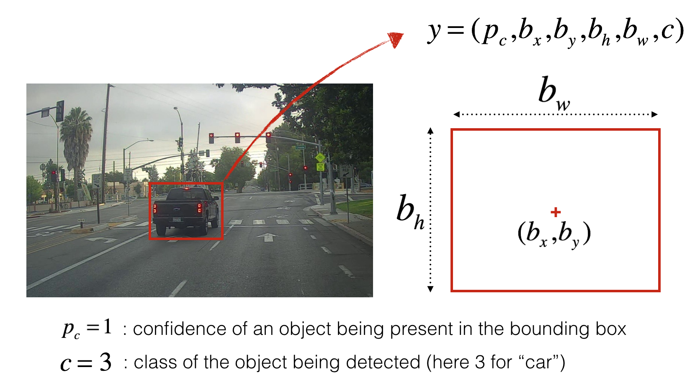

# Autonomous-driving(Car-detection)

I  built object detection model using the very powerful YOLOV2 model.

## PROJECT OUTPUT :
- The dataset(video) taken from delhi(INDIA) road(Delhi-Meerut Expressway)

I built object detection using the very powerful `YOLO model`. 
Many of the ideas in this project are described in the two YOLO papers: 
[Redmon et al., 2016](https://arxiv.org/abs/1506.02640) and [Redmon and Farhadi, 2016](https://arxiv.org/abs/1612.08242). 

In this project, I learnt how "You Only Look Once" (YOLO) performs object detection, and then apply it to car detection. 
Because the YOLO model is `very computationally expensive to train`, I load pre-trained weights to use. 

## overview of topics :
- Use object detection on a car detection dataset
- Deal with bounding boxes

## Problem Statement

Suppose, I am working on a self-driving car. 
As a critical component of this project, I'd like to first build a car detection system.
To collect data, We've  to mounted a camera to the hood (meaning the front) of the car, which takes pictures of the road ahead every few seconds
while we drive around. 

I've gathered all these videos and divide into frames(images) then kept into folder and have labelled them by drawing bounding boxes around every car I found. 
Here's an example of what my bounding boxes look like.

<caption>
 <u> Figure 1  </u>: Definition of a box   
</caption>

If I have 80 classes that I want the object detector to recognize, 
I can represent the class label `c` either as an integer from 1 to 80, or as an 80-dimensional vector (with 80 numbers) 
one component of which is 1 and the rest of which are 0. In this project, I used both representations, 
depending on which is more convenient for a particular step.  

## YOLO :
"You Only Look Once" (YOLO) is a popular algorithm because it achieves high accuracy while also being able to run in real-time.
This algorithm "only looks once" at the image in the sense that it requires only one forward propagation pass through the network to make predictions.
After non-max suppression, it then outputs recognized objects together with the bounding boxes.

###  Model details

#### Inputs and outputs
- The **input** is a batch of images, and each image has the shape (m, 608, 608, 3)
- The **output** is a list of bounding boxes along with the recognized classes. 
  Each bounding box is represented by 6 numbers `(p_c, b_x, b_y, b_h, b_w, c)` as explained above. 
  If I expand `c` into an 80-dimensional vector, each bounding box is then represented by 85 numbers. 

#### Anchor Boxes
* Anchor boxes are chosen by exploring the training data to choose reasonable height/width ratios that represent the different classes.  For this project, 5 anchor boxes were chosen(to cover the 80 classes), and stored in the file './model_data/yolo_anchors.txt'
* The dimension for anchor boxes is the second to last dimension in the encoding: `(m, n_H,n_W,anchors,classes)`.
* The YOLO architecture is: IMAGE (m, 608, 608, 3) -> DEEP CNN -> ENCODING (m, 19, 19, 5, 85).  

#### Encoding
Let's look in greater detail at what this encoding represents. 

<caption>
 <u>Figure 2 </u>:Encoding architecture for YOLO  
</caption>

If the center/midpoint of an object falls into a grid cell, that grid cell is responsible for detecting that object.

Since I uses 5 anchor boxes, each of the 19 x19 cells thus encodes information about 5 boxes. Anchor boxes are defined only by their width and height.

For simplicity, I flatten the last two last dimensions of the shape (19, 19, 5, 85) encoding. So the output of the Deep CNN is (19, 19, 425).

<caption>
 <u> Figure 3 </u>: Flattening the last two last dimensions  
</caption>

#### Class score

Now, for each box (of each cell) I compute the following element-wise product and extract a probability that the box contains a certain class.  
The class score is *score_{c,i} = p_{c} \times c_{i}*: the probability that there is an object `p_{c}` times
the probability that the object is a certain class *c_{i}*.

<caption>
 <u> Figure 4 </u>: Find the class detected by each box  
</caption>

##### Example of figure 4
* In figure 4, let's say for box 1 (cell 1), the probability that an object exists is `p_{1}=0.60`.  So there's a 60% chance that an object exists in box 1 (cell 1).  
* The probability that the object is the class "category 3 (a car)" is `c_{3}=0.73`.  
* The score for box 1 and for category "3" is `score_{1,3}=0.60 \times 0.73 = 0.44`.  
* Let's say we calculate the score for all 80 classes in box 1, and find that the score for the car class (class 3) is the maximum.  So we'll assign the score 0.44 and class "3" to this box "1".

#### Visualizing classes
Here's one way to visualize what YOLO is predicting on an image:
- For each of the 19x19 grid cells, find the maximum of the probability scores (taking a max across the 80 classes, one maximum for each of the 5 anchor boxes).
- Color that grid cell according to what object that grid cell considers the most likely.

Doing this results in this picture: 

<caption>
 <u> Figure 5 </u>: Each one of the 19x19 grid cells is colored according to which class has the largest predicted probability in that cell.  
</caption>

Note that this visualization isn't a core part of the YOLO algorithm itself for making predictions; it's just a nice way of visualizing an intermediate result of the algorithm. 

#### Visualizing bounding boxes
Another way to visualize YOLO's output is to plot the bounding boxes that it outputs. Doing that results in a visualization like this:  

<caption>
 <u> Figure 6 </u>: Each cell gives me 5 boxes. In total, the model predicts: 19x19x5 = 1805 boxes just by looking once at the image (one forward pass through the network)! Different colors denote different classes.   
</caption>

#### Non-Max suppression
In the figure above, we plotted only boxes for which the model had assigned a high probability, but this is still too many boxes. I'd like to reduce the algorithm's output to a much smaller number of detected objects.  

To do so, I used **non-max suppression**. Specifically, I carry out these steps: 
- Get rid of boxes with a low score (meaning, the box is not very confident about detecting a class; either due to the low probability of any object, or low probability of this particular class).
- Select only one box when several boxes overlap with each other and detect the same object.

<caption>
 <u>Figure 7</u>: In this example, the model has predicted 3 cars, but it's actually 3 predictions of the same car. 
Running non-max suppression (NMS) will select only the most accurate (highest probability) of the 3 boxes.   
</caption>

Non-max suppression uses the very important function called **"Intersection over Union"**, or IoU.

<caption>
 <u> Figure 8 </u>: Definition of "Intersection over Union".   
</caption>

## Summary for YOLO:
- Input image (608, 608, 3)
- The input image goes through a CNN, resulting in a (19,19,5,85) dimensional output. 
- After flattening the last two dimensions, the output is a volume of shape (19, 19, 425):
    - Each cell in a 19x19 grid over the input image gives 425 numbers. 
    - 425 = 5 x 85 because each cell contains predictions for 5 boxes, corresponding to 5 anchor boxes. 
    - 85 = 5 + 80 where 5 is because `(p_c, b_x, b_y, b_h, b_w)` has 5 numbers, and 80 is the number of classes we'd like to detect
- I then select only few boxes based on:
    - Score-thresholding: throw away boxes that have detected a class with a score less than the threshold
    - Non-max suppression: Compute the Intersection over Union and avoid selecting overlapping boxes
- This gives me YOLO's final output. 

## Files :
- [font](font): font information
- [images](images): unseen images for resting purpose
- [model_data](model_data): model
- [nb_images](nb_images): notebook images and videos
- [out](out): outcomes of model
- [yad2k](yad2k): useful models
- [Autonomous_driving_application_Car_detection_tensorflow1.ipynb](Autonomous_driving_application_Car_detection_tensorflow1.ipynb): complete project descriptions
- [requirements.txt](requirements.txt): complete packages list
- [yolo_utils.py](yolo_utils.py): useful function

## Commands to Run Code :
- First : [Download](https://www.kaggle.com/rmoharir8396/yolo-h5-file) yolo.h5 file and put in model_data folder.
- second : Install project dependencies:
    - pip install -r requirements.txt
    - pip show <packagename> (for more information about individual packages from the requiements.txt)
- last:Run jupyter notebook([Autonomous_driving_application_Car_detection_tensorflow1.ipynb](Autonomous_driving_application_Car_detection_tensorflow1.ipynb))
(The Jupyter Notebook is an open-source web application that allows you to create and share documents 
that contain live code, equations, visualizations and narrative text. 
Uses include: data cleaning and transformation, numerical simulation, statistical modeling, data visualization, machine learning, and much more.)

Detail explanation is given in notebook. [Please refer](Autonomous_driving_application_Car_detection_tensorflow1.ipynb) .

The notebook written in deep explanation with mathematical function.

The code succesfully run on **Keras==2.0.3 and tensorflow==1.15.0**.

## What Need to remember:
    
- YOLO is a state-of-the-art object detection model that is fast and accurate
- It runs an input image through a CNN which outputs a 19x19x5x85 dimensional volume. 
- The encoding can be seen as a grid where each of the 19x19 cells contains information about 5 boxes.
- We filter through all the boxes using non-max suppression. Specifically: 
    - Score thresholding on the probability of detecting a class to keep only accurate (high probability) boxes
    - Intersection over Union (IoU) thresholding to eliminate overlapping boxes
- Because training a YOLO model from randomly initialized weights is non-trivial and requires a large dataset as well as lot of computation,
I used previously trained model parameters in this project. In future, I plan to try fine-tuning the YOLO model with my own dataset, 
though this would be a fairly non-trivial project. 

**References**: The ideas presented in this project came primarily from the two YOLO papers. The implementation here also took significant inspiration and used many components from Allan Zelener's GitHub repository. The pre-trained weights used in this project came from the official YOLO website. 
- Joseph Redmon, Santosh Divvala, Ross Girshick, Ali Farhadi - [You Only Look Once: Unified, Real-Time Object Detection](https://arxiv.org/abs/1506.02640) (2015)
- Joseph Redmon, Ali Farhadi - [YOLO9000: Better, Faster, Stronger](https://arxiv.org/abs/1612.08242) (2016)
- Allan Zelener - [YAD2K: Yet Another Darknet 2 Keras](https://github.com/allanzelener/YAD2K)
- The official YOLO website (https://pjreddie.com/darknet/yolo/) 
