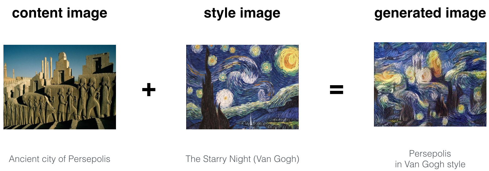

# DL_P15_Deep-Learning-Art-Neural-Style-Transfer

In this project, I have Implemented the neural style transfer algorithm and Generated novel artistic images using my algorithm.
This algorithm was created by [Gatys et al. (2015).](https://arxiv.org/abs/1508.06576)

Most of the algorithms I've studied optimize a cost function to get a set of parameter values. 
In Neural Style Transfer, I optimized a cost function to get pixel values!

## Problem Statement

Neural Style Transfer (NST) is one of the most fun techniques in deep learning. As seen below, it merges two images, namely: a **"content" image (C) and a "style" image (S), to create a "generated" image (G**). 

The generated image G combines the "content" of the image C with the "style" of image S. 

In this project, I went to generate an image of the Louvre museum in Paris (content image C), mixed with a painting by Claude Monet, a leader of the impressionist movement (style image S).

This code is documented so you can follow along while reading with the paper. You can also just replace with your own images and to generate your new painting.

## Transfer Learning

Neural Style Transfer (NST) uses a previously trained convolutional network, and builds on top of that. The idea of using a network trained on a different task and applying it to a new task is called transfer learning. 

Following the [original NST paper](https://arxiv.org/abs/1508.06576), I used the VGG network. Specifically,I used VGG-19, a 19-layer version of the VGG network. This model has already been trained on the very large ImageNet database, and thus has learned to recognize a variety of low level features (at the shallower layers) and high level features (at the deeper layers). 

## Neural Style Transfer (NST)

Basically, The Neural Style Transfer (NST) algorithm built in three steps:

- Built the content cost function J_content(C,G)
- Built the style cost function J_style(S,G)
- Put it together to get J(G) = alpha* J_content(C,G) + beta* J_style(S,G). 

## Implemention Neural Style Transfer!

1. Create an Interactive Session
2. Load the content image 
3. Load the style image
4. Randomly initialize the image to be generated 
5. Load the VGG19 model
7. Build the TensorFlow graph:
    - Run the content image through the VGG19 model and compute the content cost
    - Run the style image through the VGG19 model and compute the style cost
    - Compute the total cost
    - Define the optimizer and the learning rate
8. Initialize the TensorFlow graph and run it for a large number of iterations, updating the generated image at every step.

## Files:

- [images](images) : content and style images
- [output](output) : outputs of projects
- [res_paper](res_paper) : project related res_papaer
- [Art_Generation_with_Neural_Style_Transfer.ipynb](Art_Generation_with_Neural_Style_Transfer.ipynb) : complete project description
- [nst_utils.py](nst_utils.py) : some useful functions
- [requirements.txt](requirements.txt) : complete packages list

## Commands to Run Code :

- First : create folder name "pretrained-model" and Download the [VGG-19 model](http://www.vlfeat.org/matconvnet/models/imagenet-vgg-verydeep-19.mat) and
put in that folder.
- second : Install project dependencies:
     *  pip install -r requirements.txt
     *  pip show (for more information about individual packages from the requiements.txt)
- last:Run jupyter notebook([Art_Generation_with_Neural_Style_Transfer.ipynb](Art_Generation_with_Neural_Style_Transfer.ipynb)) (The Jupyter Notebook is an open-source web application that allows you to create and share documents that contain live code, equations, visualizations and narrative text. Uses include: data cleaning and transformation, numerical simulation, statistical modeling, data visualization, machine learning, and much more.)
- Detail explanation is given in notebook. [Please refer](Art_Generation_with_Neural_Style_Transfer.ipynb) .

The notebook written in deep explanation with mathematical function.

The code succesfully run on Keras==2.0.3 and tensorflow==1.15.0.

## Here are few other examples:

- The beautiful ruins of the ancient city of Persepolis (Iran) with the style of Van Gogh (The Starry Night)

- The tomb of Cyrus the great in Pasargadae with the style of a Ceramic Kashi from Ispahan.

- A scientific study of a turbulent fluid with the style of a abstract blue fluid painting.

## Conclusion

I now able to use Neural Style Transfer to generate artistic images.
This is also my first time building a model in which the optimization algorithm updates the pixel values rather than the neural network's parameters. 
Deep learning has many different types of models and this is only one of them! 

## What Things should remember:

- Neural Style Transfer is an algorithm that given a content image C and a style image S can generate an artistic image
- It uses representations (hidden layer activations) based on a pretrained ConvNet. 
- The content cost function is computed using one hidden layer's activations.
- The style cost function for one layer is computed using the Gram matrix of that layer's activations. The overall style cost function is obtained using several hidden layers.
- Optimizing the total cost function results in synthesizing new images. 

## References:

The Neural Style Transfer algorithm was due to Gatys et al. (2015). Harish Narayanan and Github user "log0" also have highly readable write-ups fro
m which I drew inspiration. The pre-trained network used in this implementation is a VGG network, which is due to Simonyan and Zisserman (2015). 
Pre-trained weights were from the work of the MathConvNet team. 

- Leon A. Gatys, Alexander S. Ecker, Matthias Bethge, (2015). [A Neural Algorithm of Artistic Style](https://arxiv.org/abs/1508.06576) 
- Harish Narayanan, [Convolutional neural networks for artistic style transfer.](https://harishnarayanan.org/writing/artistic-style-transfer/)
- Log0, [TensorFlow Implementation of "A Neural Algorithm of Artistic Style".](http://www.chioka.in/tensorflow-implementation-neural-algorithm-of-artistic-style)
- Karen Simonyan and Andrew Zisserman (2015). [Very deep convolutional networks for large-scale image recognition](https://arxiv.org/pdf/1409.1556.pdf)
- [MatConvNet.](http://www.vlfeat.org/matconvnet/pretrained/)

